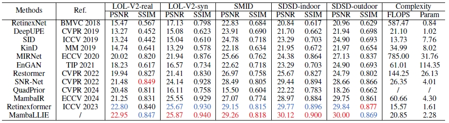
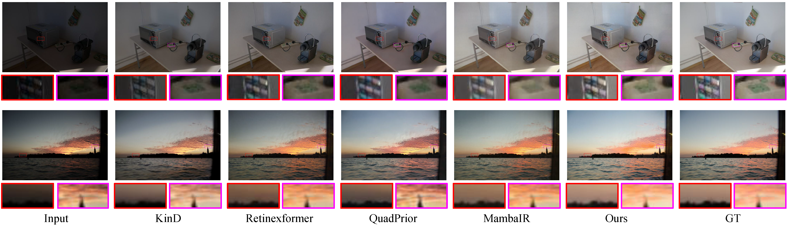

# (NeurIPS 2024) MambaLLIE: Implicit Retinex-Aware Low Light Enhancement with Global-then-Local State Space

[Jiangwei Weng](https://wengjiangwei.github.io/), [Zhiqiang Yan](https://scholar.google.com/citations?hl=zh-CN&user=0wale0IAAAAJ), [Ying Tai](https://scholar.google.com/citations?user=NKaiUasAAAAJ&hl=en), [Jianjun Qian](http://www.patternrecognition.asia/qian/), [Jian Yang](http://202.119.85.163/open/TutorInfo.aspx?dsbh=tLbjVM9T1OzsoNduSpyHQg==&yxsh=4iVdgPyuKTE=&zydm=L-3Jh59wXco=), [Jun Li<sup>*</sup>](https://sites.google.com/view/junlineu/)

Nanjing University of Science and Technology & Nanjing University


[Paper](https://arxiv.org/abs/2405.16105) | [Project Page](https://wengjiangwei.github.io/projectPage/MambaLLIE/index.html)

This repository represents the official implementation of the paper titled "MambaLLIE: Implicit Retinex-Aware Low Light Enhancement with Global-then-Local State Space".


#### News
- **Oct 31, 2024:** Training & Testing codes and pre-trained models are released!
- **Sep 26, 2024:** Our paper has been accepted by NeurIPS 2024. Code and Models will be released.
<hr />


> **Abstract:** * Recent advances in low light image enhancement have been dominated by Retinex-based learning framework, leveraging convolutional neural networks (CNNs) and Transformers. However, the vanilla Retinex theory primarily addresses global illumination degradation and neglects local issues such as noise and blur in dark conditions. Moreover, CNNs and Transformers struggle to capture global degradation due to their limited receptive fields. While state space models (SSMs) have shown promise in the long-sequence modeling, they face challenges in combining local invariants and global context in visual data.In this paper, we introduce MambaLLIE, an implicit Retinex-aware low light enhancer featuring a global-then-local state space design. We first propose a Local-Enhanced State Space Module (LESSM) that incorporates an augmented local bias within a 2D selective scan mechanism, enhancing the original SSMs by preserving local 2D dependencies. Additionally, an Implicit Retinex-aware Selective Kernel module (IRSK) dynamically selects features using spatially-varying operations, adapting to varying inputs through an adaptive kernel selection process. Our Global-then-Local State Space Block (GLSSB) integrates LESSM and IRSK with layer normalization (LN) as its core. This design enables MambaLLIE to achieve comprehensive global long-range modeling and flexible local feature aggregation. Extensive experiments demonstrate that MambaLLIE significantly outperforms state-of-the-art CNN and Transformer-based methods. * 
>

<p align="center">
  
</p>

---

## Results
<details>
<summary><strong>Quantitative comparisons on LOL-V2-real, LOL-V2-syn, SMID, SDSD-indoor and SDSD-
outdoor datasets. The best result is in red color while the second best result is in blue color.</strong> (click to expand) </summary>
  

</details>

<details>
<summary><strong>LOL-V2-real and LOL-V2-syn</strong> (click to expand) </summary>
 
</details>

<details>
<summary><strong>SMID, SDSD-indoor and SDSD-ourdoor</strong> (click to expand) </summary>

</details>

<details>
<summary><strong>RealWorld Experimental Evaluation</strong> (click to expand) </summary>
  

</details>

## Installation

Please see [Conda.sh] for the installation of dependencies required to run MambaLLIE.

## Training and Evaluation

Download our models from [Google Drive](https://drive.google.com/drive/folders/1ahQ7QW6xq2PImAFNxElNNLXQED8kqkxg?dmr=1&ec=wgc-drive-hero-goto). Put them in folder pretrained_weights.

```shell
# activate the environment
conda activate MambaLLIE

# Train LOL-v2-real
python3 basicsr/train.py --opt options/train/LOLv2_real.yml

# Test LOL-v2-real
python3 basicsr/test.py --opt options/test/LOLv2_real.yml

```

## Acknowledgement

This code is based on [BasicSR](https://github.com/XPixelGroup/BasicSR), [MambaIR](https://github.com/csguoh/MambaIR), [Retinexformer](https://github.com/caiyuanhao1998/Retinexformer), [SNR-Net](https://github.com/dvlab-research/SNR-Aware-Low-Light-Enhance), and [LSKNet](https://github.com/zcablii/LSKNet). Thanks for their awesome work.


## Contact
Should you have any question, please contact wengjiangwei@njust.edu.cn.

## Citation
If you use MambaLLIE, please consider citing:

    @article{MambaLLIE,
    title={MambaLLIE: Implicit Retinex-Aware Low Light Enhancement with Global-then-Local State Space},
    author={Jiangwei Weng and Zhiqiang Yan and Ying Tai and Jianjun Qian and Jian Yang and Jun Li},
    journal={NeurIPS 2024},
    year={2024}
    }
